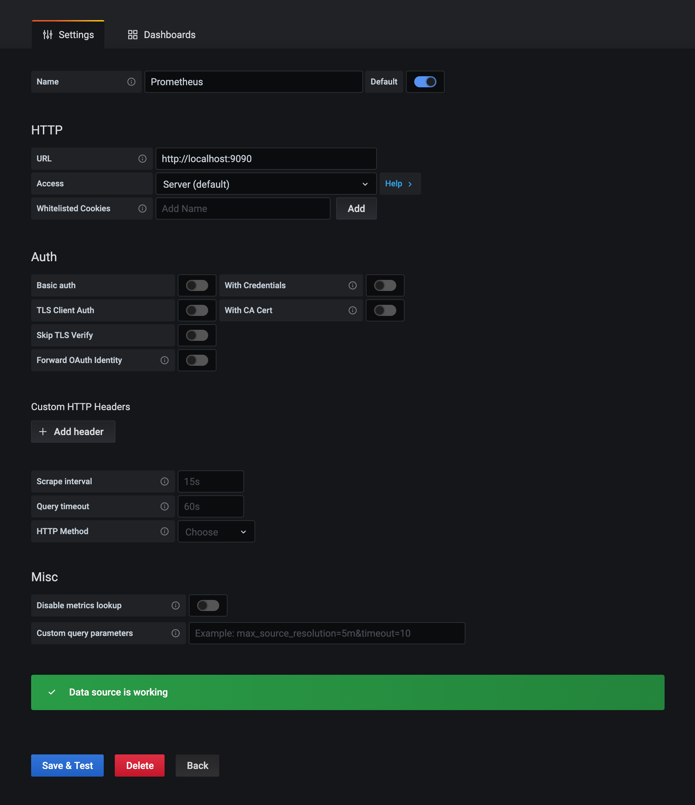
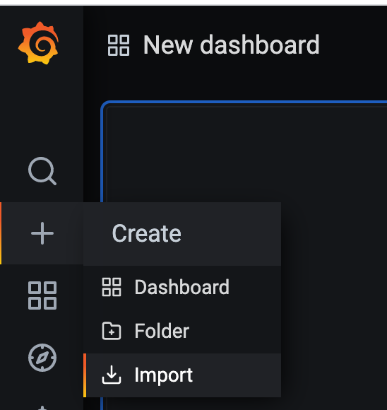
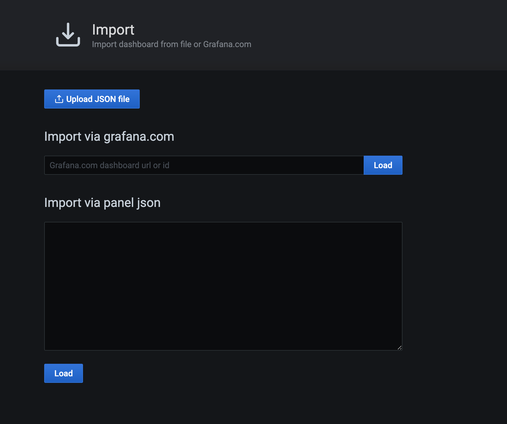
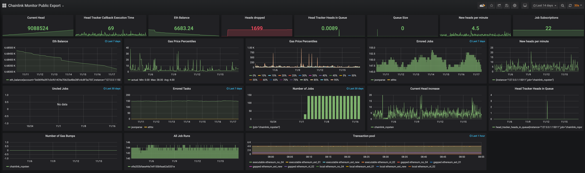

# Prometheus and grafana with Chainlink Tutorial

## Install prerequisites
For this tutorial you need a working Prometheus and Grafana setup. Prometheus needs to run on a machine with sufficient disk (or at least the ability to increase it preferably online), once you're hooked to it you will want to add more metrics :)

Lets start with setting up grafana

### Grafana
Just follow the steps here for your distribution
https://grafana.com/grafana/download

After installation it should be available on http://[your ip]:3000/login

### Prometheus
You can just install Prometheus with apt or yum, this tutorial assumes ubuntu

```
apt install -y prometheus
```

This installs prometheus and enables and starts it with systemd. The UI of prometheus is available at http://[your ip]:9090 by default. The prometheus node exporter exports interesting information about the system running prometheus on http://[your ip]:9100/metrics. Its not needed for the rest of this tutorial so you could disable it if you want.

For both its advised to firewall the ports or change the listen address to local loopback in `/etc/default/prometheus` and `/etc/default/prometheus-node-exporter`.
  
```
ARGS="--web.listen-address=127.0.0.1:9090"
```

### Configure Prometheus
Now we need to tell Prometheus to scrape the metrics of the chainlink node. Chainlink exposes metrics on the /metrics endpoint of the ui, by default thats http://localhost:6688/metrics. One important thing to notice is that prometheus cannot scrape from https endpoints so if you configured https you will also need to open your http endpoint specifically for prometheus.

Telling prometheus to scrape something is done by editing the /etc/prometheus/prometheus.yml file and adding these lines:
```
# A scrape configuration containing exactly one endpoint to scrape:
# Here it's Prometheus itself.
scrape_configs:
  # The job name is added as a label `job=<job_name>` to any timeseries scraped from this config.

  - job_name: 'chainlink_p1'
    static_configs:
    - targets: ['127.0.0.1:6688']
    metrics_path: '/metrics'
```
change the target accordingly and restart prometheus with `service prometheus restart`. If you run two nodes you can add them both with a different name (in this example chainlink_p1 and chainlink_p2). Mind that these names are used in the dashboard example as well.

### Configure grafana datasource
Now login to your grafana install with admin/admin and change your password. Click the add new datasource link and select prometheus. Enter `http://localhost:9090` as url and click `save & test`. 



Now import the example dashboard by saving the dashboard.json file in this repository and uploading it on grafana



You're all set, you should see the following screen


There is one extra panel on the dashboard that retrieved metrics from your ethereum node if you set that up to send export metrics as well. This blogpost has some excellent information on that topic:
https://blog.ethereum.org/2019/07/10/geth-v1-9-0/

### Alerting
Both Grafana and Prometheus have lots of alerting options to explore. These metrics are good to monitor on:

- Ethereum balance dropping below certain level
- New heads per minute dropping below 1 for more than 5 minutes (this means your chainlink node is not getting new heads from Ethereum)
- Head tracker heads in queue should be 0 most of the time, so alerting when its averaging > 1 for more than 5 minutes
- Head tracker callback execution time: depending on your setup you should have this value well below 1 second (between 100/300ms). If its averaging above 1s you want to check your ethereum connection and any bottlenecks on postgres cpu/memory wise
- Heads dropped should be 0, higher values indicate your node can't keep up with the new heads

There are a lot more interesting metrics to explore, like some metrics on fluxmonitor jobs
